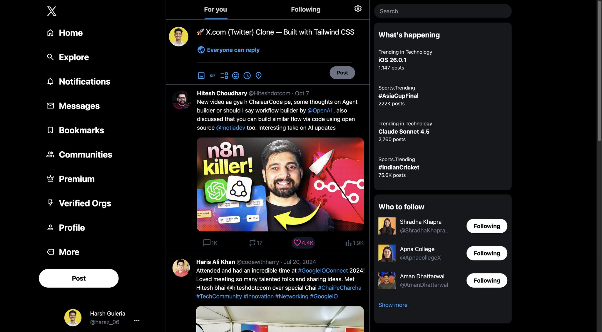
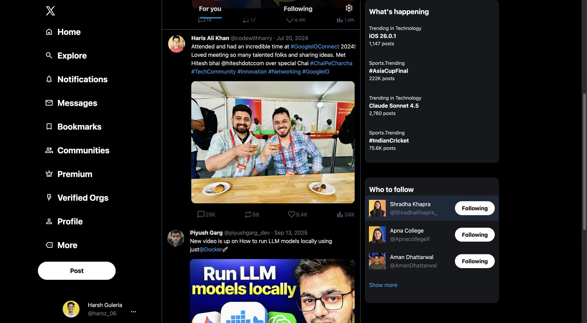

# 🚀 X.com (Twitter) Clone

A **fully responsive Twitter (X.com) Clone** built using **Tailwind CSS** as part of the **Sigma Web Development Course** by **CodeWithHarry Sir**.  

This project helped me **enhance my skills in modern UI design, responsive layouts, and utility-first CSS** using Tailwind.  

## Features
- Fully responsive layout for desktop and mobile
- Header, feed, sidebar, and tweet components
- Tailwind CSS utility classes used throughout
- Clean and modern UI design

## Skills Learned
- **Tailwind CSS**: Utility-first styling, responsive design, flex/grid layouts
- **Responsive Web Design**: Mobile-first approach, media queries
- **Frontend Development**: Structuring a real-world clone project

## Screenshots




## Installation
1. Clone the repo:  
```bash
git clone https://github.com/your-username/X-Clone-Tailwind.git
```
2. Open index.html in your browser.

## Connect With Me

- GitHub: [@Harsz06](https://x.com/harsz_06)
- Email: guleriah59@gmail.com
- YouTube Course: [X.com (Twitter) Clone using Tailwind CSS | Sigma Web Development Course](https://www.youtube.com/watch?v=iegMqFnVocA&list=PLu0W_9lII9agq5TrH9XLIKQvv0iaF2X3w&index=101)
